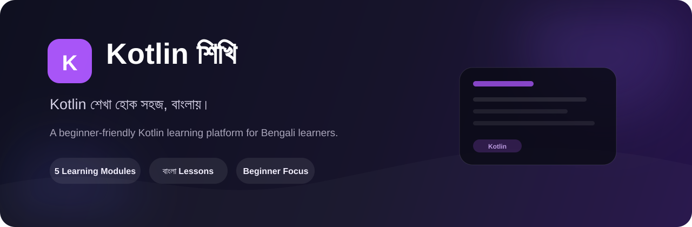

  

<h1 align="center">Kotlin শিখি</h1>

  বাংলা ভাষায় সহজ ও ধাপে ধাপে Kotlin শেখার একটি beginner-friendly learning platform।

  <a href="https://kotlin-shikhi.vercel.app">
    🌐 Live Website
  </a>

---

## 📖 Kotlin শিখি কী?

**Kotlin শিখি** হলো বাংলা ভাষাভাষী beginners-দের জন্য তৈরি একটি Kotlin learning platform।

Kotlin-এর বিভিন্ন concept-কে ছোট ছোট topic ও lesson-এ ভাগ করে সাজানো হয়েছে, যাতে একজন beginner ধাপে ধাপে Kotlin-এর fundamental concepts বুঝতে পারে।

প্রতিটি lesson-এর লক্ষ্য হলো programming concept-গুলোকে সহজ বাংলায় ব্যাখ্যা করা এবং প্রয়োজনীয় Kotlin code example-এর মাধ্যমে বিষয়গুলো পরিষ্কার করা।

---

## 🗺️ Learning Roadmap

Kotlin শেখার journey বর্তমানে কয়েকটি structured module-এ ভাগ করা হয়েছে।

### 🌱 01 — Introduction

- Intro
- Hello World & Output
- Syntax
- Comment

### 📦 02 — Variables & Data Types

- Variable কী?
- `val` ও `var`
- Variable-এর Naming Rules
- Variable-এ Value পরিবর্তন
- Type Inference
- Type Annotation
- Data Types পরিচিতি
- Numbers
- String
- Char
- Boolean
- Type Conversion

### 🧮 03 — Operators

- Operators পরিচিতি
- Arithmetic Operators
- Assignment Operators
- Comparison Operators
- Logical Operators
- Unary Operators
- Prefix & Postfix
- Operator Precedence

### 🔀 04 — Control Flow & Decision Making

- Control Flow পরিচিতি
- `if` Statement
- `else` Statement
- `else if`
- Nested `if`
- `when` Expression

### 🔁 05 — Loops & Ranges

- Loops পরিচিতি
- Range পরিচিতি
- `..` Range Operator
- `..<` Range Operator
- `downTo`
- `step`
- Range-এর Direction & Step

---

## ✨ Features

- 🇧🇩 বাংলা ভাষায় Kotlin শেখার অভিজ্ঞতা
- 🧩 ছোট ছোট micro-lessons
- 🗺️ Structured learning roadmap
- 💻 সহজ ও practical Kotlin examples
- 📱 Mobile-friendly interface
- 🎯 Beginner-focused explanations
- 📚 Topic-based learning
- 🧭 সহজ lesson navigation

---

## 🛠️ Built With

  
  
  
  

---

## 🌐 Live Website

### [🚀 Visit Kotlin শিখি](https://kotlin-shikhi.vercel.app)

---

## 📊 Learning Modules

| # | Module | Topics |
|---|---|---:|
| 01 | 🌱 Introduction | 4 |
| 02 | 📦 Variables & Data Types | 12 |
| 03 | 🧮 Operators | 8 |
| 04 | 🔀 Control Flow & Decision Making | 6 |
| 05 | 🔁 Loops & Ranges | 7 |

---

## 🎯 লক্ষ্য

Kotlin শেখার শুরুতে beginners অনেকগুলো নতুন programming concept-এর মুখোমুখি হয়। **Kotlin শিখি** সেই শেখার প্রক্রিয়াকে ছোট এবং সহজ ধাপে ভাগ করার চেষ্টা করে।

প্রধান লক্ষ্য:

- সহজ বাংলায় Kotlin শেখানো
- বড় concept-কে ছোট topic-এ ভাগ করা
- Beginner-friendly explanation তৈরি করা
- Practical code example ব্যবহার করা
- একটি পরিষ্কার learning path তৈরি করা

---

## 🚧 Project Status

**Active Development**

Kotlin শিখি বর্তমানে development-এর মধ্যে রয়েছে।

বর্তমানে Kotlin-এর fundamentals, variables & data types, operators, control flow এবং loops & ranges-এর বিভিন্ন বিষয় নিয়ে কাজ করা হচ্ছে।

পরবর্তীতে আরও lessons, practice এবং learning features যুক্ত করা হবে।

---

## 🤝 Contributing

Project-টি এখনো active development-এর মধ্যে রয়েছে।

Kotlin lesson-এর ভুল সংশোধন, content improvement অথবা নতুন feature-এর suggestion থাকলে contribution welcome।

---

## 📌 Repository

**GitHub Repository:**  
https://github.com/xusvai/kotlin-shikhi

**Live Website:**  
https://kotlin-shikhi.vercel.app

---

## 💜 Kotlin শিখি

**Kotlin শেখা হোক সহজ, বাংলায়।**

Made with ❤️ for Bengali Kotlin learners.

